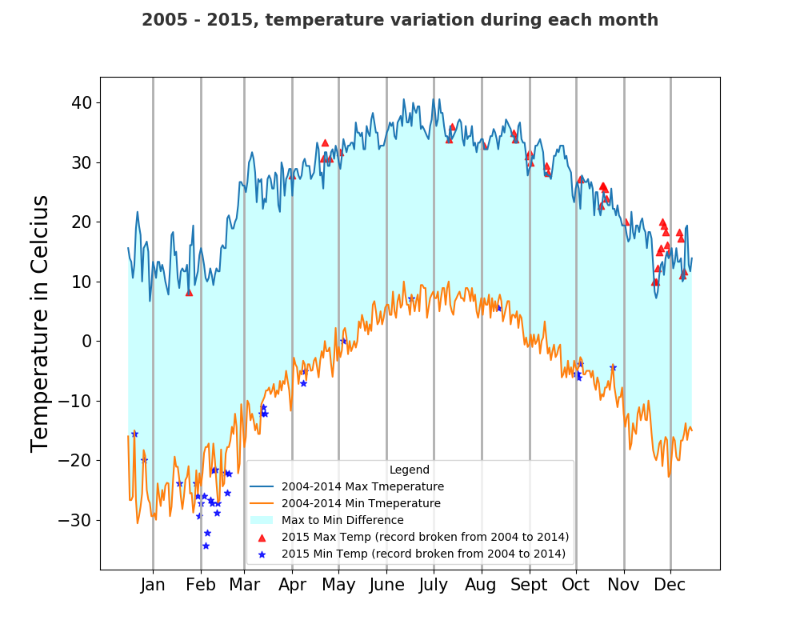

#The data for this assignment comes from a subset of The National Centers for Environmental Information (NCEI) Daily Global Historical
#Climatology Network (GHCN-Daily). The GHCN-Daily is comprised of daily climate records from thousands of land surface stations across #the globe. Each row in the assignment datafile corresponds to a single observation.

#The python code which returns a line graph of the record high and record low temperatures by day of the year over the period 2005-2014. #The area between the record high and record low temperatures for each day is be shaded. Using scatter plot to overlay of the 2015 data #for any points (highs and lows) for which the ten year record (2005-2014) record high or record low was broken in 2015.

#The Output RESULT :

%matplotlib notebook
import matplotlib.pyplot as plt
import numpy as np
import pandas as pd

def plot_temprature(binsize):

    df = pd.read_csv('data/C2A2_data/BinnedCsvs_d{}.csv'.format(binsize))
    df['Data_Value']=df['Data_Value'].apply(lambda x:x/10)
    
    df['Date']= pd.to_datetime(df['Date'])
    df['Day']=df['Date'].dt.day
    df['Month']=df['Date'].dt.month
    df['Year']=df['Date'].dt.year
    df.drop(df[(df['Month']==2.0) & (df['Day']> 28.0)].index,inplace=True)
    df2015 = df.where(df['Year']==2015).dropna()
    df = df.where(df['Year']!=2015).dropna()

    df_max=df.groupby(['Month','Day'])['Data_Value'].max().reset_index()
    df_min=df.groupby(['Month','Day'])['Data_Value'].min().reset_index()
    df2015_max=df2015.groupby(['Month','Day'])['Data_Value'].max().reset_index()
    df2015_min=df2015.groupby(['Month','Day'])['Data_Value'].min().reset_index()
    fig=plt.figure(figsize=(10, 8))
    i = np.arange(0,365)
    m = ['Jan','Feb','Mar','Apr','May','June','July','Aug','Sept','Oct','Nov','Dec']
    
    plt.plot(list(i),list(df_max['Data_Value']),'-',label = '2004-2014 Max Tmeperature')
    plt.plot(list(i),list(df_min['Data_Value']),'-',label = '2004-2014 Min Tmeperature')
    plt.gca().fill_between(range(len(df_max['Data_Value'])), df_max['Data_Value'], df_min['Data_Value'], facecolor='cyan', alpha=0.20,label='Max to Min Difference')
    
    cmax =  df2015_max[df2015_max['Data_Value'] > df_max['Data_Value']]
    cmin =  df2015_min[df2015_min['Data_Value'] < df_min['Data_Value']]
    
    plt.scatter(cmax.index,cmax['Data_Value'],c='r',alpha=0.80, marker='^', label='2015 Max Temp (record broken from 2004 to 2014)')
    plt.scatter(cmin.index,cmin['Data_Value'],c='b',alpha=0.80,marker='*', label='2015 Min Temp (record broken from 2004 to 2014)')
    
    ax=plt.gca()
    ticks = [(dt.date(2017,m,1)-dt.date(2016,12,16)).days for m in range(1,13)]
    ax.set_xticks(ticks)
    ax.set_xticklabels(m)
    
    plt.ylabel('Temperature in Celcius',fontsize=20)
    fig.suptitle('2005 - 2015, temperature variation during each month', alpha=0.8,fontsize=15, fontweight='bold')
 
    ax.legend( frameon=True, title='Legend')
    plt.grid(b=None, which='both', axis='x',linewidth=2)
    ax.xaxis.set_tick_params(labelsize=15)
    ax.yaxis.set_tick_params(labelsize=15)
    
    return plt.show()

